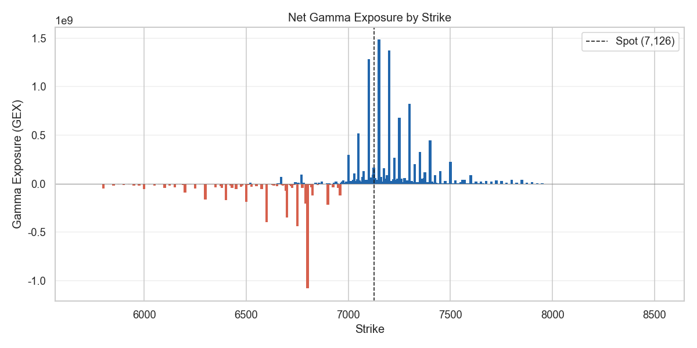
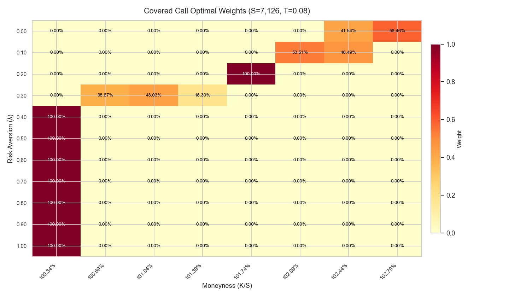

# option probability portfolio

Extract risk-neutral probability distributions from option chains and optimize covered call strike allocation using Monte Carlo simulation.

---

## Pipeline

```
Option Chain → IV Surface Fitting → Breeden-Litzenberger PDF → Monte Carlo Sampling → Covered Call Optimization
                (SABR / SVI)           ∂²C/∂K²                  (Inverse CDF)            Mean-Variance
```

## Core Mathematics

### 1. Implied PDF (Breeden-Litzenberger)

$$q(K) = e^{rT} \frac{\partial^2 C}{\partial K^2}$$

Fit the IV surface via SABR or SVI, then recover the risk-neutral density through finite differences on a dense strike grid. Butterfly and call-spread arbitrage conditions are enforced before extraction.

### 2. Model-Free Implied Moments (Bakshi-Kapadia-Madan 2003)

$$V = 2\int \frac{1 - \ln(K/F)}{K^2} \cdot O(K)\,dK, \quad W = \int \frac{6\ln(K/F) - 3\ln^2(K/F)}{K^2} \cdot O(K)\,dK$$

Compute variance, skewness, and kurtosis directly from OTM option prices — no model assumptions required.

### 3. Covered Call Objective

$$\min_{\mathbf{x}} \; -(1-\lambda)\,\mathbb{E}[R] + \lambda\,\text{Var}[R] + \eta\,\text{Var}_{\text{timing}}[R]$$

Terminal prices $S_T$ are sampled directly from the implied PDF via inverse CDF sampling. Following Israelov & Nielsen (2015), the covered call return is decomposed into passive equity, short volatility, and dynamic equity (equity timing) components. The timing variance term penalizes uncompensated equity reversal exposure arising from option convexity.

## Usage

```python
from pdf import OptionImpliedPDF
from optim import BuyWriteOptimizer

# 1. Extract implied PDF
model = OptionImpliedPDF(option_chain_df, rf=0.035, dividend=0.0138)
model.fit(method='sabr', mny_bounds=(0.15, 0.15), check_arbitrage=True)

# 2. Optimize covered call
optimizer = BuyWriteOptimizer(Ks=model.Ks, S=model.S, T=T, r=rf)
optimizer.fit(pdfs=model.pdf.values, N=100_000)
weights = optimizer.optimize(
    price=model.price,
    mnys=target_strikes / S,
    risk_aversion=np.arange(0.1, 1.0, 0.1),
)
```

## Key Features

- **IV Surface Fitting**: SABR, SVI, and PCHIP interpolation with automatic arbitrage detection and correction
- **Implied PDF Sampling**: Inverse CDF sampling from the risk-neutral density with trapezoid integration
- **Mean-Variance Optimization**: Risk aversion sweep across strike allocations with total cover ratio constraint
- **Solver Options**: Brute-force Monte Carlo (parallelized) or COBYLA with warm-start across risk aversion levels
- **Greeks Monitor**: GEX, VEX, gamma/vanna profiles, and flip point computation

## Output Examples

### Implied PDF Diagnostics


### Net Gamma Exposure by Strike


### Gamma Profile


### Covered Call Optimal Weights


## References

- Breeden & Litzenberger (1978) — *Prices of State-Contingent Claims Implicit in Option Prices*
- Bakshi, Kapadia & Madan (2003) — *Stock Return Characteristics, Skew Laws, and Differential Pricing*
- Hagan et al. (2002) — *Managing Smile Risk* (SABR)
- Gatheral & Jacquier (2014) — *Arbitrage-Free SVI Volatility Surfaces*
- Israelov & Nielsen (2015) — *Covered Calls Uncovered* (equity timing decomposition)

## License

MIT
